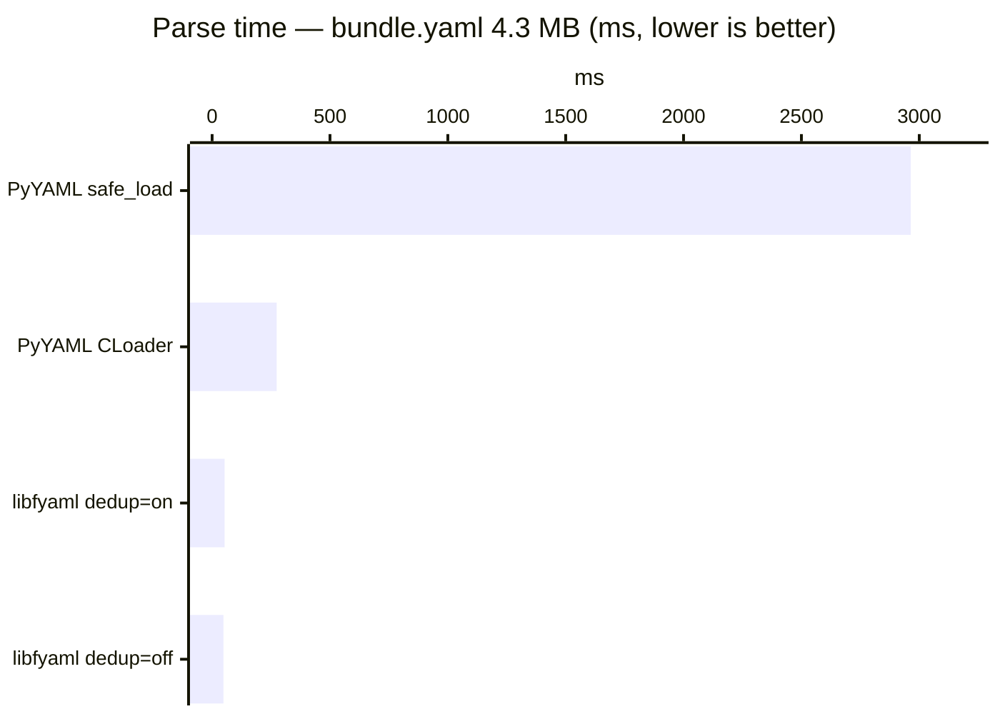
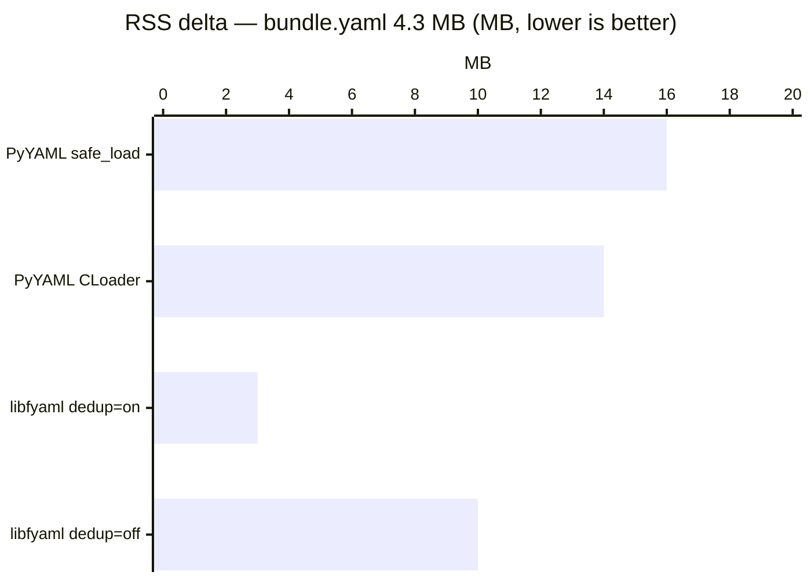

# libfyaml Python Binding — API Reference

The `libfyaml` Python binding exposes the high-performance libfyaml C library
directly. Parsed documents are represented as `FyGeneric` objects — lazy
wrappers that defer conversion to Python types until you ask for them. This
keeps memory low and lets you navigate large documents without materialising
every node.

---

## Table of Contents

1. [Quick Start](#quick-start)
2. [Parsing](#parsing)
   - [Parse modes](#parse-modes)
   - [Parser options](#parser-options)
3. [The FyGeneric Type](#the-fygeneric-type)
   - [Type checking](#type-checking)
   - [Converting to Python](#converting-to-python)
   - [Container access](#container-access)
   - [Tags and anchors](#tags-and-anchors)
   - [Source markers](#source-markers)
   - [Comments](#comments)
   - [Diagnostics](#diagnostics)
4. [Serialisation](#serialisation)
   - [Scalar styles](#scalar-styles)
5. [Converting Python objects](#converting-python-objects)
6. [Path navigation](#path-navigation)
7. [Mutability](#mutability)
8. [FyDocumentState](#fydocumentstate)
9. [Memory management](#memory-management)
10. [Error handling](#error-handling)
11. [Comparison with PyYAML](#comparison-with-pyyaml)

---

## Quick Start

```python
import libfyaml as fy

# Parse a YAML string
doc = fy.loads("name: Alice\nage: 30")
print(doc["name"])   # FyGeneric wrapping "Alice"
print(str(doc["name"]))  # "Alice"
print(doc.to_python())   # {'name': 'Alice', 'age': 30}

# Parse a file
doc = fy.load("config.yaml")

# Serialise back to YAML
print(fy.dumps(doc))

# Parse JSON
data = fy.loads('{"x": 1}', mode='json')
```

---

## Parsing

### `loads(s, **options) → FyGeneric`

Parse a YAML or JSON **string**. Raises `ValueError` if the input contains
more than one document — use `loads_all` for multi-document streams.

```python
doc = fy.loads("key: value")
docs = fy.loads_all("---\na: 1\n---\nb: 2")  # list of FyGeneric
```

### `load(file, **options) → FyGeneric`

Parse from a **file path** (string — uses mmap internally) or any **file-like
object** with a `.read()` method.

```python
doc = fy.load("data.yaml")

with open("data.yaml") as f:
    doc = fy.load(f)
```

### `loads_all(s, **options) → list[FyGeneric]`
### `load_all(file, **options) → list[FyGeneric]`

Return all documents in a multi-document stream as a list.

```python
docs = fy.loads_all("---\n1\n---\n2\n---\n3")
# [FyGeneric(1), FyGeneric(2), FyGeneric(3)]
```

---

### Parse modes

The `mode` parameter controls which YAML dialect is accepted:

| Mode string | Meaning |
|---|---|
| `'yaml'`, `'yaml1.2'`, `'1.2'` | YAML 1.2 — the default |
| `'yaml1.1'`, `'1.1'` | YAML 1.1 (accepts merge keys `<<`, sexagesimal numbers, etc.) |
| `'yaml1.1-pyyaml'`, `'pyyaml'` | YAML 1.1 with PyYAML-compatible quirks (used by the compat layer) |
| `'json'` | Strict JSON |

```python
# Merge keys only work in YAML 1.1
doc = fy.loads("""
defaults: &defaults
  timeout: 30

server:
  <<: *defaults
  host: localhost
""", mode='yaml1.1')
```

---

### Parser options

All four parse functions accept the same keyword options:

| Option | Default | Description |
|---|---|---|
| `mode` | `'yaml'` | Dialect — see above |
| `dedup` | `True` | Use the deduplication allocator (saves memory for documents with repeated content) |
| `trim` | `True` | Release unused allocator memory after parsing |
| `mutable` | `False` | Produce mutable `FyGeneric` objects (required for `__setitem__` and `set_at_path`) |
| `collect_diag` | `False` | Attach parse diagnostics to the result instead of raising |
| `create_markers` | `False` | Record byte/line/column positions for every node |
| `keep_comments` | `False` | Preserve YAML comments in the document |
| `keep_style` | `False` | Preserve original scalar styles (literal, folded, quoted, …) |

---

## The FyGeneric Type

`FyGeneric` is the type returned by all parse functions. It wraps a C
`fy_generic` value without copying data. Conversion to Python only happens
when you explicitly ask for it.

```python
doc = fy.loads("x: 42")
type(doc)          # <class 'libfyaml._libfyaml.FyGeneric'>
doc.__class__      # <class 'dict'>  — the Python equivalent class
```

### Type checking

Eight predicate methods, all return `bool`:

```python
v = fy.loads("42")
v.is_null()       # False
v.is_bool()       # False
v.is_int()        # True
v.is_float()      # False
v.is_string()     # False
v.is_sequence()   # False
v.is_mapping()    # False
v.is_indirect()   # True if the value carries a tag or anchor
```

### Converting to Python

```python
doc = fy.loads("items: [1, 2, 3]")

# Recursive — the whole document becomes plain Python
doc.to_python()   # {'items': [1, 2, 3]}

# Scalar coercions
n = fy.loads("99")
int(n)    # 99
float(n)  # 99.0
bool(n)   # True
str(n)    # "99"
```

`to_python()` raises `TypeError` if a mapping key is unhashable (e.g. a
nested mapping used as a key).

### Container access

Sequences and mappings support the standard Python container protocol:

```python
doc = fy.loads("fruits: [apple, banana, cherry]")
fruits = doc["fruits"]

len(fruits)      # 3
fruits[0]        # FyGeneric("apple")
str(fruits[0])   # "apple"
"banana" in fruits  # True (linear scan)

for item in fruits:
    print(str(item))

# Mappings
doc["fruits"]           # FyGeneric sequence
doc.keys()              # ['fruits']
doc.values()            # [FyGeneric sequence]
doc.items()             # [('fruits', FyGeneric sequence)]
```

Attribute access on mappings delegates to the underlying dict:

```python
doc = fy.loads("host: localhost\nport: 8080")
str(doc.host)   # "localhost"
int(doc.port)   # 8080
```

Numeric operations on integer and float values work directly:

```python
v = fy.loads("10")
v + 5    # 15
v * 2    # 20
v > 5    # True
```

### Tags and anchors

```python
doc = fy.loads("value: !!int '42'")
v = doc["value"]
v.has_tag()    # True
v.get_tag()    # "tag:yaml.org,2002:int"

doc2 = fy.loads("x: &myanchor hello\ny: *myanchor")
doc2["x"].has_anchor()   # True
doc2["x"].get_anchor()   # "myanchor"
```

### Source markers

Markers record the byte offset, line, and column of each node in the original
source. Enable them at parse time with `create_markers=True`.

```python
doc = fy.loads("host: localhost\nport: 8080", create_markers=True)

m = doc["host"].get_marker()
# (start_byte, start_line, start_col, end_byte, end_line, end_col)
# e.g. (6, 0, 6, 15, 0, 15)

doc["host"].has_marker()   # True
doc["port"].get_marker()   # (22, 1, 6, 31, 1, 15)
```

Lines and columns are zero-based. `get_marker()` returns `None` when markers
were not enabled.

### Comments

Preserve YAML comments by parsing with `keep_comments=True`.

```python
yaml_text = """\
# Server settings
host: localhost  # primary
port: 8080
"""
doc = fy.loads(yaml_text, keep_comments=True)
doc["host"].get_comment()   # "# primary"
doc["host"].has_comment()   # True
```

### Diagnostics

With `collect_diag=True` parse errors are attached to the document rather than
raised immediately. This lets you process partially-valid input.

```python
doc = fy.loads("good: ok\nbad: {unclosed", collect_diag=True)
doc.has_diag()   # True
doc.get_diag()   # FyGeneric describing the error(s)
```

---

## Serialisation

### `dumps(obj, *, compact=False, json=False, style=None, indent=0) → str`

Serialise a `FyGeneric` or plain Python object to a YAML (or JSON) string.

```python
doc = fy.loads("name: Alice\nscores: [10, 20, 30]")
print(fy.dumps(doc))
# name: Alice
# scores:
#   - 10
#   - 20
#   - 30

print(fy.dumps(doc, compact=True))
# {name: Alice, scores: [10, 20, 30]}

print(fy.dumps(doc, json=True))
# {"name": "Alice", "scores": [10, 20, 30]}
```

`indent` sets the indentation width (2–8 spaces; 0 uses the library default).

### `dump(file, obj, *, mode='yaml', compact=False)`

Write to a file path (string) or file-like object. `mode` accepts `'yaml'` or
`'json'`.

```python
fy.dump("output.yaml", doc)

with open("output.json", "w") as f:
    fy.dump(f, doc, mode='json')
```

### `dumps_all(documents, *, compact=False, json=False, style=None) → str`
### `dump_all(file, documents, *, compact=False, json=False)`

Serialise a list of documents with `---` separators.

```python
docs = fy.loads_all("---\na: 1\n---\nb: 2")
print(fy.dumps_all(docs))
# ---
# a: 1
# ---
# b: 2
```

### Individual node serialisation

`FyGeneric` objects have their own `.dump()` method:

```python
doc = fy.loads("x: 1\ny: 2")
doc["x"].dump()                          # returns "1\n"
doc["x"].dump(strip_newline=True)        # returns "1"
doc["x"].dump("node.yaml")               # writes to file
doc["x"].dump(sys.stdout, mode='json')   # writes to file object
```

---

### Scalar styles

The `style` parameter controls how scalar values are written. Accepted values:

| Style | Effect |
|---|---|
| `None` or `'default'` | Library default (usually plain) |
| `'original'` | Preserve the style from the parsed input (requires `keep_style=True` at parse time) |
| `'block'` | Block scalars (literal `\|` or folded `>`) |
| `'flow'` | Flow / inline style |
| `'pretty'` | Readable multi-line format |
| `'compact'` | Compact single-line |
| `'oneline'` | Force everything onto one line |

```python
doc = fy.loads("text: 'hello world'")
print(fy.dumps(doc, style='block'))
print(fy.dumps(doc, style='flow'))
```

---

## Converting Python objects

### `from_python(obj, *, tag=None, style=None, mutable=False, dedup=True) → FyGeneric`

Convert a plain Python object (`dict`, `list`, `str`, `int`, `float`, `bool`,
`None`) to a `FyGeneric`. Useful for attaching tags or styles before
serialisation.

```python
# Attach a YAML tag
v = fy.from_python("hello", tag="!mytag")
print(fy.dumps(v))   # !mytag hello

# Control the scalar style
text = fy.from_python("line one\nline two\n", style='|')
print(fy.dumps(text))
# |
#   line one
#   line two
```

Scalar `style` values accepted by `from_python`:

| Style | Meaning |
|---|---|
| `'|'` | Literal block scalar |
| `'>'` | Folded block scalar |
| `"'"` | Single-quoted |
| `'"'` | Double-quoted |
| `'plain'` or `''` | Plain (unquoted) |

---

## Path navigation

### `get_at_path(path) → FyGeneric`
### `get_at_unix_path(path_str) → FyGeneric`

Navigate into a nested document. A path is a list of keys (strings) and
indices (integers).

```python
doc = fy.loads("""
servers:
  - host: web01
    port: 80
  - host: web02
    port: 443
""")

doc.get_at_path(["servers", 0, "host"])      # FyGeneric("web01")
doc.get_at_unix_path("/servers/0/host")      # FyGeneric("web01")
doc.get_at_unix_path("/servers/1/port")      # FyGeneric(443)
```

`get_at_path` raises `KeyError` if the path does not exist.

### `get_path() → tuple` / `get_unix_path() → str`

Return the path of a node within its document (useful when iterating):

```python
doc = fy.loads("a:\n  b:\n    c: 42")
v = doc.get_at_unix_path("/a/b/c")
v.get_unix_path()    # "/a/b/c"
v.get_path()         # ('a', 'b', 'c')
```

### Path utility functions

```python
fy.path_list_to_unix_path(["servers", 0, "host"])   # "/servers/0/host"
fy.unix_path_to_path_list("/servers/0/host")         # ["servers", 0, "host"]
```

---

## Mutability

By default `FyGeneric` objects are immutable. Pass `mutable=True` to the parse
function (or `from_python`) to allow in-place modification.

```python
doc = fy.loads("x: 1\ny: 2", mutable=True)

doc["x"] = 99
str(doc["x"])   # "99"

doc.set_at_path(["y"], "updated")
doc.set_at_unix_path("/x", 0)

print(fy.dumps(doc))
# x: 0
# y: updated
```

Attempting to modify an immutable object raises `TypeError`.

---

## FyDocumentState

`FyDocumentState` carries the YAML directives that appeared before a document.
Access it via `FyGeneric.document_state`.

```python
doc = fy.loads("%YAML 1.2\n---\nkey: value")
ds = doc.document_state

ds.version           # (1, 2)
ds.version_explicit  # True
ds.json_mode         # False
ds.tags              # list of {'handle': ..., 'prefix': ...} dicts
ds.tags_explicit     # True if %TAG directives were present
```

`document_state` is `None` for values that are not document roots.

---

## Memory management

### Allocator strategy

The `dedup=True` default uses a deduplication allocator that stores only one
copy of repeated strings or scalars. This is a significant win for large
documents with repeated content (e.g. YAML files with many identical keys or
values).

Set `dedup=False` to use the standard allocator, which may be faster for
small documents or documents with little repetition.

### Trim

`trim=True` (default) releases unused allocator pages after parsing is
complete. Disable with `trim=False` if you will be building on the document
after parsing and want to avoid reallocation.

### Manual trim

```python
doc = fy.loads(large_yaml, trim=False)
# ... do some work ...
doc.trim()   # release unused memory now
```

### Clone

`clone()` creates an independent copy of a `FyGeneric` value, decoupled from
the original document's allocator:

```python
original = fy.load("big.yaml")
part = original.get_at_unix_path("/config/server").clone()
del original   # can now be collected
```

---

## Error handling

| Exception | Raised when |
|---|---|
| `ValueError` | Parse error; invalid mode string; invalid style; multiple documents where one was expected |
| `TypeError` | Wrong argument type; mutation on an immutable object; unhashable mapping key in `to_python()` or `items()` |
| `KeyError` | Path not found in `get_at_path` / `get_at_unix_path` |
| `RuntimeError` | Internal builder or emitter failure; file write error |
| `AttributeError` | Attribute access on a non-mapping `FyGeneric` |
| `NotImplementedError` | `del` on a `FyGeneric` item |

```python
try:
    doc = fy.loads("key: [unclosed")
except ValueError as e:
    print(f"Parse error: {e}")

# Or collect errors without raising:
doc = fy.loads("key: [unclosed", collect_diag=True)
if doc.has_diag():
    print(doc.get_diag().to_python())
```

---

## Comparison with PyYAML

This section describes how the **core `libfyaml` binding** relates to PyYAML.

### Where they are similar

- **Function names**: `load`, `loads`, `dump`, `dumps` follow the same
  naming convention as PyYAML's `yaml.safe_load` / `yaml.dump`.
- **Python types out**: both ultimately produce `dict`, `list`, `str`,
  `int`, `float`, `bool`, and `None`. Call `.to_python()` on a `FyGeneric`
  to get the plain Python value.
- **YAML tag handling**: both support `!!str`, `!!int`, `!!float`, `!!bool`,
  `!!null`, `!!seq`, `!!map`, `!!binary`, and custom tags.
- **Multi-document streams**: both support `---`-separated documents via
  `load_all` / `loads_all`.

### Where they diverge

#### Return type

The most immediate difference: `loads` returns a `FyGeneric`, not a native
Python object. You must call `.to_python()` (or use the object directly via
the container/numeric protocols) to get a plain `dict` or `list`.

```python
# PyYAML
import yaml
result = yaml.safe_load("x: 1")
type(result)          # dict

# libfyaml
import libfyaml as fy
result = fy.loads("x: 1")
type(result)          # FyGeneric
type(result.to_python())  # dict
```

#### API shape: mode instead of Loader

PyYAML selects behaviour through `Loader` classes (`SafeLoader`,
`FullLoader`, `BaseLoader`). libfyaml uses a `mode` string:

```python
# PyYAML
yaml.load(s, Loader=yaml.SafeLoader)
yaml.safe_load(s)

# libfyaml
fy.loads(s)                      # YAML 1.2 (roughly equivalent to SafeLoader)
fy.loads(s, mode='yaml1.1-pyyaml')  # closest to PyYAML's SafeLoader behaviour
```

There are no Loader or Dumper classes in the core binding.

#### Default YAML version: 1.2 not 1.1

libfyaml defaults to **YAML 1.2**. PyYAML implements **YAML 1.1**. This
affects implicit type resolution:

| Input | PyYAML (1.1) | libfyaml default (1.2) |
|---|---|---|
| `yes` / `no` / `on` / `off` | `True` / `False` | string |
| `0755` | `493` (octal int) | string |
| `1:30` (sexagesimal) | `90` (int) | string |
| `1.5e3` | `1500.0` | `1500.0` |
| `.inf` / `.nan` | `inf` / `nan` | `inf` / `nan` |

Use `mode='yaml1.1'` or `mode='yaml1.1-pyyaml'` to get YAML 1.1 resolution.

#### Strictness differences in YAML 1.1 mode

Even in `yaml1.1-pyyaml` mode a few corner cases differ because libfyaml
follows the YAML specification more strictly than PyYAML does:

| Situation | PyYAML | libfyaml |
|---|---|---|
| Duplicate anchor (`&a 1 ... &a 2`) | `ComposerError` | accepted (spec §3.2.2.2 allows redefinition) |
| Unknown `%DIRECTIVE` | `ScannerError` | warning, continues (spec §6.8.1 says SHOULD warn) |
| `?` in anchor name (`&?foo`) | `ScannerError` | accepted (`?` is a valid `ns-anchor-char` per spec §6.9.2) |
| Sexagesimal integers (`190:20:30`) | `685230` | string (not resolved) |
| Sexagesimal floats (`190:20:30.15`) | `685230.15` | string (not resolved) |
| Single dot (`.`) | string | `0.0` (float — C library bug) |
| `---` as flow scalar | string | `null` (C library bug) |

#### Error messages

libfyaml and PyYAML produce different human-readable error messages for the
same parse errors. Code that pattern-matches exception strings will need
adjustment; code that only catches the exception type will be fine.

#### Block scalar emission

libfyaml follows the YAML spec strictly when choosing scalar styles, which
means it will refuse to use a block scalar (`|` or `>`) in contexts where
the spec does not permit one — for example as a value inside a flow
collection. PyYAML emits block scalars in those contexts anyway, producing
output that is technically non-conformant. If you serialise a document that
PyYAML would render with block scalars inside flow collections, libfyaml will
choose a flow-compatible style (double-quoted) instead.

#### Unicode line separators (U+2028 / U+2029)

The YAML 1.2 spec (§6.5) classifies U+2028 (LINE SEPARATOR) and U+2029
(PARAGRAPH SEPARATOR) as line-break characters. libfyaml honours this in
block scalars, treating them as line breaks during both parsing and emission.
PyYAML predates this clarification and treats them as ordinary non-breaking
characters throughout. If your data contains these code points, block-style
round-trips will produce different results between the two libraries. Use
double-quoted scalars to preserve them unambiguously in either library.

#### !!binary tag syntax

libfyaml accepts inline `!!binary` scalars (`!!binary aGVsbG8=`) in addition
to the block form that PyYAML requires (`!!binary |\n  aGVsbG8=`). Both forms
decode to `bytes`.

#### Features not in PyYAML

The core binding provides capabilities that PyYAML has no equivalent for:

- **Source markers** (`create_markers=True`) — byte/line/column positions for
  every node, without the overhead of PyYAML's `Mark` objects on events.
- **Comment preservation** (`keep_comments=True`).
- **Style preservation** (`keep_style=True`) — round-trip the original scalar
  style (literal, folded, single-quoted, etc.).
- **Path navigation** — `get_at_unix_path`, `set_at_unix_path` for direct
  document surgery without tree traversal code.
- **Deduplication allocator** — dramatically lower memory usage for documents
  with repeated content.
- **`FyDocumentState`** — programmatic access to `%YAML` and `%TAG`
  directives.

---

## Appendix: Parse performance

### Methodology

Configurations were measured by running `docs/benchmark-parse.py` against
two real-world YAML files. Each configuration runs in an **isolated
subprocess** so that allocations from earlier runs cannot inflate later
measurements.

All libraries are imported **before** the baseline RSS is measured so that
library load cost (the `.so` footprint) is excluded from the delta. The RSS
delta therefore reflects only the memory added by parsing that specific file —
the data structures created, the source text mapped, the allocator pages used.

Five timed repetitions were taken per configuration; the tables report the
**median** parse time and **median peak RSS delta** across those runs.

The benchmark can be reproduced on any YAML file:

```
python3 docs/benchmark-parse.py <file.yaml> [--runs N] [--multi]
```

Use `--multi` for files containing multiple `---`-separated documents.

**Note on PyYAML compatibility.** PyYAML's `SafeLoader` and `CLoader` do not
recognise `tag:yaml.org,2002:value`, the tag YAML 1.1 assigns to a bare `=`
scalar. YAML 1.2 treats `=` as a plain string, and it appears legitimately in
both test files (e.g. as an enum value in Kubernetes CRD schemas). The
benchmark registers a one-line constructor fix so PyYAML can parse these files;
libfyaml handles them correctly without any patching.

**Environment**

| Item | Version |
|---|---|
| CPU | AMD Ryzen 5 5600X |
| Python | 3.12.3 |
| PyYAML | 6.0.1 |
| libyaml (CLoader) | 0.2.5 |
| libfyaml | v0.9.3-278 (release build) |

### Results — 6.4 MB (`AtomicCards-2-cleaned-small.yaml`, single-doc)

Magic: The Gathering card database — highly varied text content with moderate
key repetition.


| Configuration | Median | Min | RSS delta |
|---|---|---|---|
| PyYAML `safe_load` (pure Python) | 7155 ms | 7033 ms | +164 MB |
| PyYAML `CLoader` (libyaml) | 1228 ms | 1172 ms | +123 MB |
| libfyaml `dedup=True` (default) | 115 ms | 114 ms | +28 MB |
| libfyaml `dedup=False` | 102 ms | 101 ms | +25 MB |

### Results — 4.3 MB (`bundle.yaml`, multi-doc, 24 documents)

Prometheus Operator CRD bundle ([source](https://raw.githubusercontent.com/prometheus-operator/prometheus-operator/main/bundle.yaml))
— structured Kubernetes schemas with heavy key repetition (`name`, `type`,
`description`, `properties`, `spec` recurring throughout).





| Configuration | Median | Min | RSS delta |
|---|---|---|---|
| PyYAML `safe_load` (pure Python) | 2964 ms | 2919 ms | +16 MB |
| PyYAML `CLoader` (libyaml) | 274 ms | 267 ms | +14 MB |
| libfyaml `dedup=True` (default) | 53 ms | 52 ms | +3 MB |
| libfyaml `dedup=False` | 48 ms | 48 ms | +10 MB |

### Analysis

**Speed.** Across both files, libfyaml is **4–5× faster than CLoader** and
**55–60× faster than pure-Python PyYAML**. The gap against the pure Python
loader is expected — PyYAML constructs every node as a heap-allocated Python
object while iterating the event stream in interpreted bytecode. The gap
against CLoader is more meaningful: both parsers are written in C, but
libfyaml uses mmap for file I/O, a purpose-built allocator, and avoids the
two-phase parse/construct split that libyaml's event model requires.

**Memory.** libfyaml consistently uses **far less RSS than PyYAML** for the
parsed data structure. PyYAML allocates a heap object (dict, list, str, int,
…) for every node in the document; libfyaml stores values in its arena
allocator with `FyGeneric` wrappers created lazily on access. On the card
database, libfyaml uses **~78% less RSS than CLoader** (+25–28 MB vs +123 MB);
on the CRD bundle it uses **~80–98% less** (+3–10 MB vs +14 MB).

Note that libfyaml's `.so` file itself has a significant up-front import cost
(~50 MB RSS), which is a fixed one-time overhead amortised across all subsequent
`load()` calls and not included in the delta figures above.

**dedup vs no-dedup.** On the card database, `dedup=True` adds ~13 ms but saves
only ~3 MB — the text content is highly varied, so the dedup allocator finds
little to share. On the CRD bundle, `dedup=True` *saves* 7 MB compared to
`dedup=False` because Kubernetes schemas repeat the same field names (`name`,
`type`, `description`, `properties`, …) thousands of times across 24 documents.
The deduplication allocator is the right default for structured configuration
and API-schema YAML; for documents with unique free-form text, `dedup=False` is
marginally faster.
